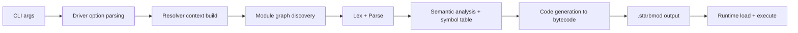

# Starbytes Compiler Workflow

Last updated: February 18, 2026

This document describes how `starbytes` processes input from CLI to execution.

## 1. End-to-End Pipeline

Main implementation entrypoint:

- `tools/driver/main.cpp`

Compiler core:

- Lexer: `src/compiler/Lexer.cpp`
- Parser: `src/compiler/SyntaxA.cpp`, `src/compiler/SyntaxADecl.cpp`, `src/compiler/SyntaxAExpr.cpp`
- Semantic analysis: `src/compiler/SemanticA.cpp`, `src/compiler/DeclSema.cpp`, `src/compiler/ExprSema.cpp`
- Codegen: `src/compiler/CodeGen.cpp`
- Runtime: `src/runtime/RTEngine.cpp`

## 2. Driver Commands

Supported commands:

- `run` (default): compile then execute
- `compile`: compile only (unless `--run`)
- `check`: parse + semantic checks only
- `help`

Global-style options include:

- `-m, --modulename`
- `-o, --output`
- `-d, --out-dir`
- `--run`, `--no-run`
- `--clean`
- `--print-module-path`
- `--no-diagnostics`
- `-n, --native` (repeatable)
- `-L, --native-dir` (repeatable)
- `--no-native-auto`

## 3. Resolver Context and `.starbmodpath`

A resolver context is built before module graph discovery. It defines additional module search roots.

### 3.1 `.starbmodpath` file

- File name: `.starbmodpath`
- Content: one directory path per line
- Accepted line forms:
  - blank line: ignored
  - comment line starting with `#` or `//`: ignored
  - path line: consumed
- Relative paths are resolved relative to the directory containing `.starbmodpath`
- Non-existent/non-directory entries are ignored with warnings
- Paths are deduplicated preserving first-seen order

### 3.2 Where `.starbmodpath` is loaded

At startup, the driver tries to load `.starbmodpath` from:

1. executable directory (`argv[0]` parent)
2. executable directory parent
3. input root
4. input root parent

`input root` is:

- input directory itself if input is a directory
- parent directory if input is a file

### 3.3 Built-in search roots

Resolver context also includes default workspace roots:

- `workspaceRoot`
- `workspaceRoot/modules`
- `workspaceRoot/stdlib`

## 4. Module Graph Discovery

### 4.1 Input Modes

- Single source file input
- Module directory input

### 4.2 Directory module discovery

For each module directory:

1. Collect all `*.starb` and `*.starbint` files
2. Sort deterministically by filename, with `main.starb` forced last if present
3. Extract imports by line-regex (`import <Identifier>`)
4. Resolve each import to a module directory
5. Recurse and build a dependency DAG
6. Detect cycles with DFS visitation stack

### 4.3 Single file discovery

For single-file roots:

1. Parse imports from the root file
2. Resolve imported module directories
3. Discover imported directory modules recursively
4. Append root file as final build unit

### 4.4 Import resolution order

For module name `M`, candidate directories are tested in order:

1. `<currentModuleDir>/M`
2. `<currentModuleDir parent>/M`
3. `<workspaceRoot>/M`
4. `<workspaceRoot>/modules/M`
5. `<workspaceRoot>/stdlib/M`
6. For each resolver root `R`: `<R>/M`

First existing directory wins.

## 5. Parse + Semantic Passes

### 5.1 Parse order

Build units are processed in topological order. Each source file is parsed into AST statements.

### 5.2 Symbol table behavior

Semantic pass validates declarations/expressions and writes symbol table entries for resolved declarations.

Key outcomes:

- duplicate symbol checks in exact scope
- type existence and alias resolution
- class/interface/constructor validity
- expression type checking and assignment legality
- control-flow condition type enforcement (`Bool`)

`check` command ends after this phase.

## 6. Code Generation

Codegen lowers AST into runtime bytecode stream (`RTCode` protocol).

Output stream shape:

- declaration records (`CODE_RTVAR`, `CODE_RTFUNC`, `CODE_RTCLASS_DEF`, ...)
- expression records (`CODE_BINARY_OPERATOR`, `CODE_RTIVKFUNC`, ...)
- nested blocks (`CODE_RTBLOCK_BEGIN/END`, function block begin/end)
- module terminator (`CODE_MODULE_END`)

Generated module file extension: `.starbmod`.

## 7. Runtime Execution

For `run` (or `compile --run`):

1. Open compiled module stream
2. Construct runtime interpreter (`Interp::Create()`)
3. Load explicit native modules (`--native`)
4. Optionally auto-resolve native modules for modules that use `@native`
5. Execute bytecode stream

### 7.1 Native auto-resolution search roots

Base search directories include:

- all `--native-dir` entries
- current working directory
- `cwd/stdlib`
- compiled module output directory
- `workspaceRoot/stdlib`
- `workspaceRoot/build/stdlib`
- every resolver context root (including `.starbmodpath` roots)

Per module unit, two extra roots are added:

- module directory
- module directory parent

Native candidate names checked:

- `<ModuleName>.ntstarbmod`
- `lib<ModuleName>.ntstarbmod`

## 8. Error Handling and Exit Codes

- Driver argument errors: non-zero exit and usage text
- Module graph resolution errors: non-zero exit
- Parser/sema errors: non-zero exit
- Runtime diagnostics can be suppressed with `--no-diagnostics`
- Successful execution still returns non-zero if diagnostics handler reports errors

## 9. Build Artifacts and Cleanup

- Default output directory: `.starbytes`
- Default output filename: `<moduleName>.starbmod`
- `--print-module-path` prints resolved output path
- `--clean` removes generated `.starbmod` after successful command completion

## 10. Operational Notes

- Module discovery is filesystem-based and deterministic due to sorted source order.
- `main.starb` is required for directory roots when running (`run` path).
- `.starbmodpath` extends module/native search without replacing built-in local/workspace search roots.
