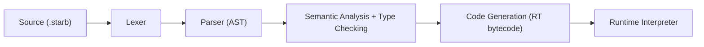
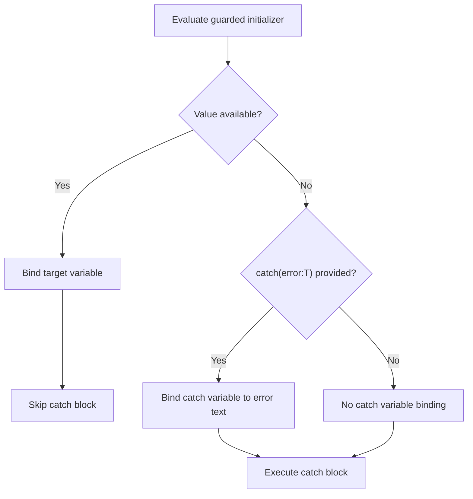
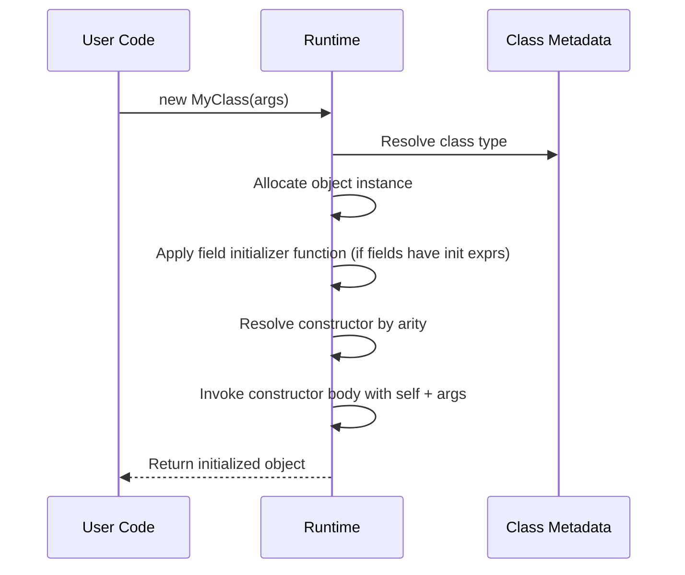

# Starbytes Syntax Design Document

This document describes the current Starbytes language syntax and behavior as implemented in this repository, plus near-term design intent where syntax is already sketched in `StarBytesSyntax.txt`.

## 1. Language Goals

Starbytes is designed as an interpreted, strongly typed language with:

- Explicit declarations (`decl`, `func`, `class`, `scope`)
- Type inference where safe
- Optional (`?`) and throwable (`!`) type qualifiers
- Structured error capture via `secure (...) catch {...}`
- Object-oriented features (classes, constructors, fields, methods)
- Namespace organization using `scope`
- Attribute metadata for declarations (system and custom)

## 2. Compilation/Execution Overview



Key runtime note:
- Regex literals compile with PCRE2 at runtime and return `Regex!` semantics (throwable on compile failure).

## 3. Lexical Structure

### 3.1 Keywords

Current keyword set in lexer:

- `import`
- `class`
- `interface` (reserved in lexer; parser support not finished)
- `decl`
- `func`
- `return`
- `imut`
- `if`
- `elif`
- `else`
- `for`
- `while`
- `secure`
- `catch`
- `new`
- `scope`

### 3.2 Literals

- String: `"hello"`
- Bool: `true`, `false`
- Number:
  - Int: `4`
  - Float: `34.12`
- Regex: `/pattern/flags`

Regex flags currently mapped:
- `i` case-insensitive
- `m` multiline
- `s` dotall
- `u` UTF mode

### 3.3 Comments

- Line comments: `// comment`
- Block comments: `/* comment */`

## 4. Declarations and Top-Level Structure

### 4.1 Namespace/Scope

`scope` is the namespace construct.

```starbytes
scope Core {
    decl greeting:String = "hello_scope"
    func makeWord() String {
        return "scope-fn"
    }
}
```

Nested scopes are supported:

```starbytes
scope Core {
    scope Math {
        func answer() Int { return 42 }
    }
}
```

Access:

```starbytes
print(Core.greeting)
print(Core.Math.answer())
```

Symbol emission/mangling for namespaced symbols uses `__` separators internally.

### 4.2 Variable and Constant Declarations

Mutable:

```starbytes
decl count:Int = 0
decl label = "demo"      // inferred String
```

Constant:

```starbytes
decl imut myConst = 4
```

Const rule:
- `decl imut x` without initializer is invalid.

### 4.3 Function Declaration

```starbytes
func add(a:Int, b:Int) Int {
    return a + b
}
```

Return type may be omitted; semantic phase infers from returns when possible.

### 4.4 Class Declaration

```starbytes
class Ticket {
    decl code:String = "unset"
    decl owner:String = "n/a"

    new(owner:String){
        self.owner = owner
        self.code = "issued"
    }

    func summary() String {
        return self.code
    }
}
```

Supported class members:
- Fields (`decl` / `decl imut`)
- Methods (`func`)
- Constructors (`new(...) { ... }`)

## 5. Attributes

Attributes use `@` prefix and can be attached to declarations.

System attributes have no namespace and no brackets around the attribute token itself:
- `@readonly`
- `@deprecated("message")`
- `@native(name="symbol_name")`

Custom attributes are accepted syntactically too.

### 5.1 Attribute Argument Forms

- Positional: `@deprecated("Legacy model")`
- Named: `@native(name="person_getName")`

Supported argument literal forms:
- string
- bool
- numeric
- identifier

### 5.2 Built-in Attribute Validation

- `@readonly`
  - Valid only on class fields
  - No args
- `@deprecated`
  - Valid on class/function/field
  - Optional single string arg
  - Named arg, if used, must be `message`
- `@native`
  - Valid on class/function
  - Requires one string arg
  - Named arg, if used, must be `name`

## 6. Type System

### 6.1 Built-in Types

- `Void`
- `String`
- `Bool`
- `Array`
- `Dict`
- `Int`
- `Float`
- `Regex`

### 6.2 Qualifiers

- Optional: `Type?`
- Throwable: `Type!`
- Both are supported by parser/type model.

Examples:

```starbytes
func maybeName() String? {
    return "optional-value"
}

func riskyName() String! {
    return "throwable-value"
}
```

### 6.3 Type Inference

Inference is active for:
- Variables with initializer
- Class fields with initializer
- Method return type (if omitted and inferable)

Constraint:
- Optional/throwable values must be captured via `secure`.

## 7. Expressions

Supported primary/compound expression patterns:

- Identifier: `x`
- Member access: `obj.field`, `Core.Math.answer`
- Invocation: `fn(arg1, arg2)`, `obj.method()`
- Constructor invocation: `new MyClass(...)`
- Assignment: `target = value`
- Binary arithmetic: `a + b`, `a - b`

Current condition expression reality:
- `if/elif/while/for` currently expect a Bool expression.
- Equality and richer boolean operators are tokenized in parts but not fully modeled as expression grammar yet.

## 8. Control Flow

### 8.1 Conditional

```starbytes
if(bar){
    print("IF-BRANCH")
}
elif(otherFlag){
    print("ELIF-BRANCH")
}
else {
    print("ELSE-BRANCH")
}
```

### 8.2 Loops

While:

```starbytes
while(state.run){
    print("WHILE-ONCE")
    state.run = false
}
```

For (currently condition-style loop form):

```starbytes
for(state.run){
    print("FOR-ONCE")
    state.run = false
}
```

## 9. Secure Declarations (`secure ... catch`)

`secure` is the required capture mechanism for optional/throwable expressions.

```starbytes
secure(decl value = maybeName()) catch {
    print("OPTIONAL-CATCH")
}
```

With catch binding:

```starbytes
secure(decl result = riskyName()) catch (error:String) {
    print(error)
}
```

Rules:
- Inner declaration must be a single `decl ... = <expr>`.
- Initializer must be optional or throwable type.
- Catch type defaults effectively to string-like error payload in runtime binding paths.

### 9.1 Secure Execution Flow



## 10. Regex Literals and Runtime PCRE2 Integration

Regex literal syntax:

```starbytes
/(?:word1|word2)/gm
```

Design:
- Parsed as literal AST node with `pattern` and `flags`.
- Type-checks as throwable regex type (`Regex!` behavior).
- Runtime compiles via PCRE2.
- Compile failures surface through `secure ... catch`.

Example:

```starbytes
secure(decl compiledRegex = /(?:word1|word2)/gm) catch (error:String) {
    print("REGEX-CATCH")
    print(error)
}

secure(decl badRegex = /(/g) catch (error:String) {
    print("REGEX-ERROR")
    print(error) // e.g. "missing closing parenthesis (offset 1)"
}
```

## 11. Class Construction Lifecycle



Notes:
- Field initializer expressions are lowered into a generated init function.
- Constructor overload resolution is currently by arity (argument count).

## 12. Namespaces and Symbol Resolution

Scope resolution supports:
- direct symbol lookup in current scope chain
- namespace member lookup (`ScopeName.symbol`)
- nested namespace member lookup (`A.B.C.symbol`)

Current restrictions:
- `scope` declaration is not allowed inside class/function scopes.
- Assignment to scope-qualified symbols is rejected (`Core.value = ...` style assignment).

## 13. Practical Use Cases

### 13.1 Namespaced Module Layout

```starbytes
scope Net {
    func endpoint() String {
        return "https://api.local"
    }
}

print(Net.endpoint())
```

Use when organizing large projects into domain sections without file-level package boilerplate.

### 13.2 Immutable Identity + Mutable State

```starbytes
class User {
    @readonly
    decl id:String
    decl name:String
}
```

Use when you need invariant identifiers but mutable profile fields.

### 13.3 Resilient Optional/Throwable Pipelines

```starbytes
func maybeToken() String? {
    return "token"
}

secure(decl token = maybeToken()) catch {
    print("fallback")
}
```

Use when enforcing explicit handling of missing/error-like values.

### 13.4 Runtime Pattern Validation

```starbytes
secure(decl expr = /([a-z]+/i) catch (error:String) {
    print("Invalid regex")
    print(error)
}
```

Use when regex comes from user/business input and parse errors must be recoverable.

## 14. EBNF-Style Quick Reference (Current Core)

```ebnf
program          = { declaration | expression } ;

declaration      = importDecl
                 | scopeDecl
                 | classDecl
                 | funcDecl
                 | varDecl
                 | secureDecl
                 | conditionalDecl
                 | whileDecl
                 | forDecl
                 | returnDecl ;

importDecl       = "import" Identifier ;
scopeDecl        = "scope" Identifier block ;
classDecl        = "class" Identifier "{" { classMember } "}" ;
classMember      = varDecl | funcDecl | ctorDecl ;
ctorDecl         = "new" "(" [ params ] ")" block ;
funcDecl         = "func" Identifier "(" [ params ] ")" [ type ] block ;
varDecl          = "decl" [ "imut" ] Identifier [ ":" type ] [ "=" expression ] ;
secureDecl       = "secure" "(" varDeclWithInit ")" "catch" [ "(" Identifier ":" type ")" ] block ;
conditionalDecl  = "if" "(" expression ")" block { "elif" "(" expression ")" block } [ "else" block ] ;
whileDecl        = "while" "(" expression ")" block ;
forDecl          = "for" "(" expression ")" block ;
returnDecl       = "return" [ expression ] ;

type             = Identifier [ "?" ] [ "!" ] ;
block            = "{" { declaration | expression } "}" ;
params           = param { "," param } ;
param            = Identifier ":" type ;

expression       = assignExpr ;
assignExpr       = additiveExpr [ "=" expression ] ;
additiveExpr     = argExpr { ("+" | "-") argExpr } ;
argExpr          = dataExpr { memberOrInvoke } ;
memberOrInvoke   = "." Identifier | "(" [ args ] ")" ;
args             = expression { "," expression } ;

dataExpr         = StringLiteral
                 | NumberLiteral
                 | BoolLiteral
                 | RegexLiteral
                 | Identifier
                 | "new" scopedIdentifier "(" [ args ] ")"
                 | "(" expression ")"
                 | "[" expression { "," expression } "]" ;

scopedIdentifier = Identifier { "." Identifier } ;
```

## 15. Reserved/Planned Syntax (Not Fully Implemented Yet)

These appear in design sheets or tokenization but are not complete parser/runtime features in the current branch:

- `interface`
- `struct`
- `enum`
- `def` / `deft` type aliases
- inline lambda declaration form
- async/lazy/await forms
- full operator set (`==`, `+=`, `-=` etc.) in expression parser

---

If you want, this document can be split next into:

1. `docs/StarbytesGrammar.ebnf` (pure grammar)
2. `docs/StarbytesTypeSystem.md` (typing and inference rules)
3. `docs/StarbytesRuntimeModel.md` (object model, bytecode, and execution semantics)

